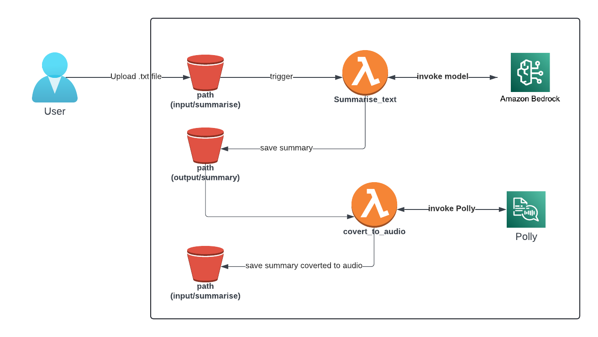

# Bedrock AWS integration sample project

This project helps you understand how to combine Amazon Bedrock with other AWS services to build powerful generative AI applications.
To demonstrate this integration in a practical way, we've implemented the project using Infrastructure as Code (IaC) with AWS CDK.

The project will implement the two samples:

1. Simple Integration: Complaint Response Lambda

This sample demonstrates a basic integration between Amazon Bedrock and AWS Lambda. The Lambda function expects a payload containing a complaint email sent to the company. It then processes the email and automatically sends a response on behalf of a customer manager. The response aims to reassure the customer that the situation will be addressed and improved.

Note: This sample focuses on generating the response and does not send it directly to the customer's email address. Additionally, there is no separate invocation method configured for the Lambda function besides the one triggered by the payload.

2. Multi-Service Integration: Text Summarization to Audio

This sample showcases a more complex integration involving multiple AWS services:

- S3 trigger: The process starts with an event notification from an S3 bucket.
- Lambda function: A Lambda function is triggered by the S3 event. This function:
    - Downloads the uploaded file from the S3 bucket.
    - Sends the file content to Amazon Bedrock for text summarization.
    - Uploads the generated summary to a new location within the same S3 bucket.
- Second S3 trigger: Another Lambda function is triggered by a separate S3 event on the new summary file path.
    - Downloads the summarized text file.
    - Uses Amazon Polly to convert the summarized text into an MP3 audio file.
    - Saves the generated MP3 audio file to a different S3 bucket path.

Note: This sample focuses on the backend functionality. Uploading and downloading files to the S3 bucket for processing would be done through the AWS Console or AWS CLI (Command Line Interface).

## AWS CDK - Infrastructure as Code

The CDK project creates the `GenAiBedrockStack` in the AWS region `us-east-1`, as defined in `bin/gen-ai-bedrock.ts`.

The `GenAiBedrockStack` stack (`lib/gen-ai-bedrock-stack.ts`) defines the following AWS resources:

- Bedrock Layer: This is a Python layer that can be used by the Lambda functions in the stack. The layer is created from the 
`src/layers/bedrock` directory.

- Reply to Complaint Function: This is a Python Lambda function named `bedrock-reply-to-complaint`. It uses the `BedrockLayer` and has a timeout of 30 seconds. The function is granted permission to invoke the `"bedrock:InvokeModel"` action.

- Result Bucket: This is an S3 bucket with the name `{account}-bedrock-lab`. The bucket is configured with S3 managed encryption. 

- Summarise Text Function: This is a Python Lambda function named  `bedrock-summarise-text`. It also uses the `BedrockLayer` and has a timeout of 90 seconds. The function is granted permission to invoke the `"bedrock:InvokeModel"` action and is triggered by `"ObjectCreated"` events in the `"input/summarise"` prefix of the `ResultBucket`.

- Convert to Audio Function: This is a Python Lambda function named `convert-text-to-audio`. It has a timeout of 30 seconds and is granted permission to use the `"polly:SynthesizeSpeech"` action. The function is triggered by `"ObjectCreated"` events in the `"output/summary"` prefix of the `ResultBucket`.

- The `addS3Trigger` method is used to set up the S3 event source triggers for the `SummariseTextFunction` and `ConvertToAudioFunction`.

- The `allowInvokeModel` and `allowPolly` methods are used to grant the necessary permissions to the Lambda functions.

## How to 

This project uses the following libraries and languages:

- `npm` - https://docs.npmjs.com/downloading-and-installing-node-js-and-npm
- `python` - https://www.python.org/doc/
- `nodejs` - https://nodejs.org/docs/latest/api/
- `aws cdk` - Can be installed with `npm install -g aws-cdk`: https://docs.aws.amazon.com/cdk/v2/guide/getting_started.html
- `docker` - https://docs.docker.com/engine/install/
- `typescript` - https://www.typescriptlang.org/

It is also required to to have 

### Getting Started 

To deploy/and make chanegs to the project, make sure to:
- Install the dependencies: `npm install` in the root folder. 
- AWS credentials/profile is configured to allow the CDK deployment project. In the case of being the first CDK stack, it will also be required to bootstrap the AWS CDK. To start with the AWS CDK, follow the instructions within `https://docs.aws.amazon.com/cdk/v2/guide/getting_started.html`.
- Make sure Docker Desktop is running, we need Docker to build the Lambda layers - the process is done automatically by the AWS CDK, there is no need of Docker knowledge to proceed with this project.
- Run `cdk synth` to see what the application wants to deploy. 
- Run `cdk deploy` once you are happy with the output of `cdk synth`. CDK deploy will provision the resources in the AWS account. 
- If you want to destroy the resources created, run `cdk destroy`.